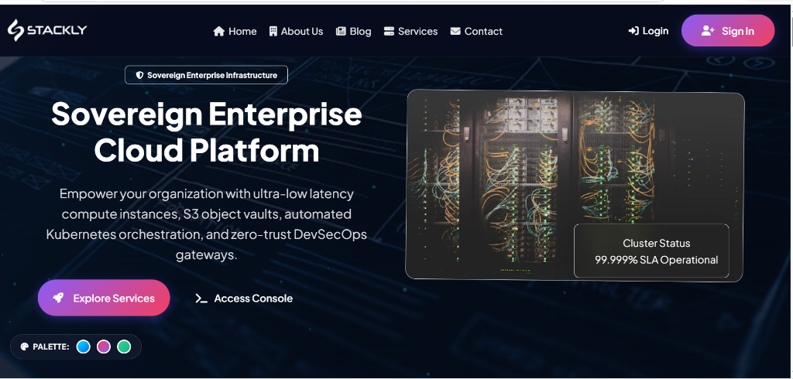
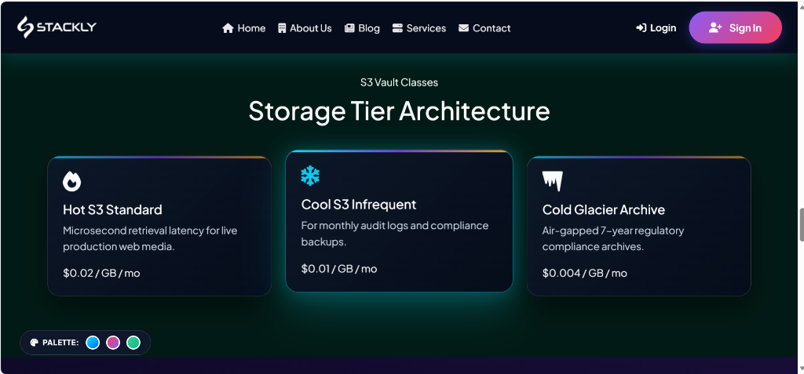
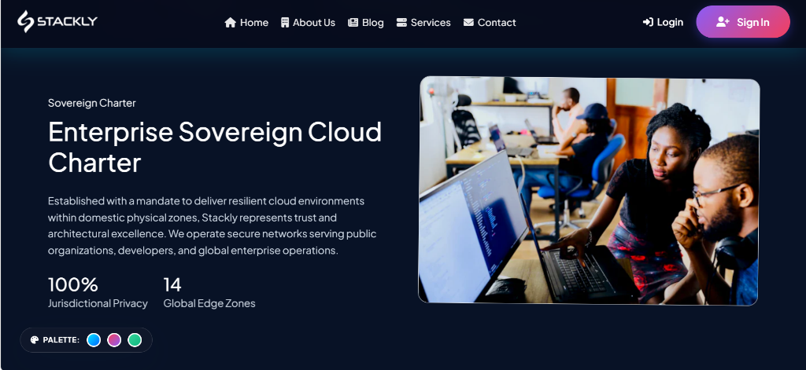
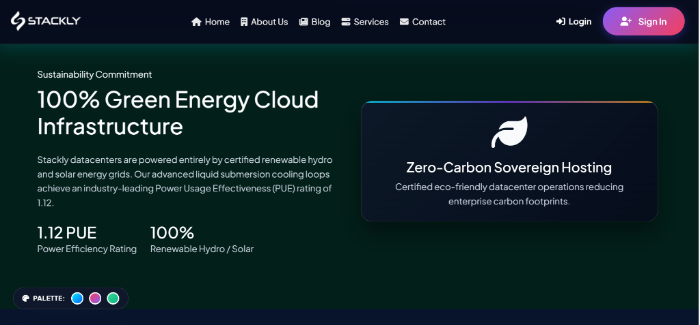
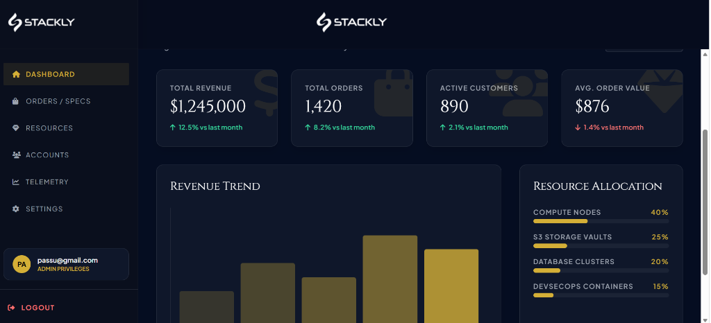
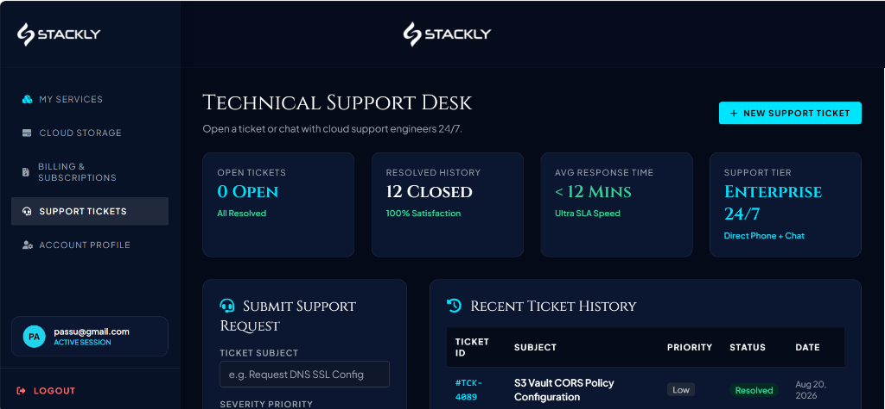

# CLOUD COMPUTING SERVICES
## Comprehensive Technical Documentation

---

### 1. Introduction & System Overview:

The Cloud Computing Services project is a high-end corporate website built to give visitors a professional and trustworthy first impression, helping them easily explore services and access their dedicated portals. Behind the scenes, the system connects a clean page layout, interactive features for user clicks and inputs, and smooth motion effects (using GSAP and Vanta.js) to keep everything running fast, feeling natural, and looking great on any screen.

The digital transformation of the cloud computing and enterprise hosting industry demands web platforms that not only present a polished public face but also provide robust, secure, and intuitive internal portals for clients and administrators. This system was explicitly designed to bridge the gap between traditional conservative hosting aesthetics and cutting-edge, modern web application capabilities. By leveraging a dark-mode first design language combined with glassmorphic overlays, the platform immediately communicates a sense of high-tech security and premium service quality.

Furthermore, the architecture prioritizes the end-user journey. Rather than overwhelming a prospective client with complex infrastructure jargon immediately, the system uses engaging micro-interactions and staggered content reveals to pace the flow of information. The integration of 3D elements and smooth scrolling mechanics ensures that users remain engaged as they learn about the firm's services, ultimately leading them seamlessly toward the secure dashboard environments where the core cloud management interactions take place.



---

### 2. Technology Stack & Dependencies



#### Frontend Technologies

##### Core Languages

* **HTML5 & CSS3**: The foundational building blocks used to structure the page content and style the modern, responsive layout, ensuring it adapts gracefully to any screen size. The use of HTML5 semantic tags ensures that screen readers and automated crawlers can perfectly digest the document hierarchy. CSS3 provides the heavy lifting for the visual presentation, utilizing advanced properties like backdrop-filters, custom variables, and complex pseudo-element layering to achieve the desired aesthetic without relying on heavy image assets.
* **Vanilla JavaScript**: Lightweight, native scripting utilized to handle real-time user inputs, click events, form logic, and dynamic interface behaviors without unnecessary overhead. By intentionally avoiding heavy frontend frameworks (such as React or Angular) for this initial marketing and portal shell, the application achieves near-instantaneous Time To Interactive (TTI) scores. The JavaScript is modularly organized, directly manipulating the Document Object Model (DOM) only when necessary, which drastically reduces parsing and compilation times on mobile devices.

##### Styling Architecture

* **Custom CSS Architecture**: Features a robust, modular CSS setup utilizing CSS Variables (Custom Properties) for easy theming (e.g., `--primary-color: #4f46e5;` , `--dark-bg: #0f172a;`). This architectural decision guarantees that any brand color updates or typography scaling adjustments can be executed globally by simply modifying the variables defined in the `:root` scope. It also lays a perfect foundation for eventually implementing a dynamic Light/Dark mode toggle, as the entire color system is decoupled from specific class names and hardcoded hex values.

#### External Libraries & Dependencies

* **Font Awesome Icons**: Included via CDN (`6.4.0`) to provide a vast library of scalable vector icons used across navigation, buttons, and feature lists. Vector icons ensure that iconography remains perfectly crisp on high-DPI (Retina) displays without the bandwidth penalty associated with loading dozens of individual PNG or SVG image files.
* **Google Fonts (Plus Jakarta Sans)**: Imported clean sans-serif typeface utilizing weights 300, 400, 500, 600, 700, and 800 to establish clear visual hierarchy and high readability across all screen sizes. Plus Jakarta Sans was selected specifically for its geometric clarity and excellent legibility when rendering numbers and technical cloud telemetry data grids.
* **GSAP (GreenSock Animation Platform)**: Loaded externally to power high-performance, hardware-accelerated visual reveals, transitions, and complex 3D motion sequences on content cards. GSAP bypasses the traditional DOM animation bottlenecks, allowing for buttery-smooth 60 frames-per-second (FPS) animations even during heavy scrolling events.
* **AOS (Animate On Scroll)**: Utilized to trigger lightweight, staggered entrance animations as elements come into view during page scrolling. This prevents cognitive overload by ensuring that content only appears when the user is actually looking at that specific section of the viewport.
* **Three.js & Vanta.js (Globe)**: Integrated to generate the interactive, 3D globe background effects present in the dashboard environments. These libraries utilize WebGL to render complex 3D geometries directly on the graphics processing unit (GPU), ensuring the portal environments feel alive and premium without choking the main browser thread.

---

### 3. File Architecture & Directory Structure

The project is structured as a Multi-Page Application (MPA), where each separate HTML file serves as an independent, dedicated screen or page view. This traditional routing model was chosen to maximize Search Engine Optimization (SEO) capabilities for the public pages and simplify the static hosting deployment process.

```
cloud computing services/
├── index.html
├── about.html
├── service.html
├── blog.html
├── contact.html
├── login.html
├── signin.html
├── dashboard_role1.html
├── dashboard_role2.html
├── 404.html
├── style.css
├── dashboard.css
├── main.js
├── auth.js
├── dashboard.js
└── assets/
 ├── logo.webp
 └── [various images]
```

#### File Breakdown

* **index.html**: The flagship entry point for the application. It contains the heaviest marketing elements, including the 3D interactive hero section, global infrastructure parallax visuals, and the primary call-to-action funnels.
* **about.html, service.html, blog.html, contact.html**: Auxiliary marketing pages. They share the core navigation and footer structures but are optimized to deliver specific textual content regarding the firm's history, service offerings, industry insights, and communication channels.
* **login.html & signin.html**: The dedicated authentication portals. Stripped of heavy marketing navigation to remove distractions and focus entirely on credential input and secure access.
* **dashboard_role1.html**: The comprehensive Agency/Admin portal. This file contains the sprawling tabbed layout for high-level executives, featuring massive metric grids, analytical breakdown sections, and administrative controls.
* **dashboard_role2.html**: The Customer/Client portal. A restricted, heavily focused layout designed to show individual clients their personal cloud infrastructure audits, pending tasks, and project timelines.
* **404.html**: A customized error boundary page designed to catch dead links while maintaining the overarching brand aesthetic, preventing user abandonment.
* **style.css & dashboard.css**: The separation of styles ensures that the heavy, complex grid rules required for the internal dashboards (`dashboard.css`) do not bloat the initial load payload of the public-facing marketing pages (`style.css`).
* **main.js, auth.js, dashboard.js**: Segregated JavaScript logic handling global interactions, secure form validation, and complex SPA-like tab routing respectively.

---

### 4. Visual Design System (UI/UX)

#### Visual Design Language & Color Palette

* **Glassmorphism Effects**: Crafted using CSS `backdrop-filter: blur(20px)`, semi-transparent background color fills (e.g., `rgba(30, 41, 59, 0.7)`), and subtle border highlights to give cards and navigation panels a frosted, modern look. The glassmorphism approach allows the deep, atmospheric background gradients and 3D elements to bleed through the interface components subtly. This establishes a clear sense of depth and hierarchy (Z-axis positioning) on a flat 2D screen, guiding the user's eye to the foreground content without entirely obscuring the premium background visuals.
* **Modern CSS Grid & Flexbox**: Implements responsive layouts and bento-box structures via `display: grid` and `display: flex` rules to seamlessly organize content across all screen sizes. Grid is utilized heavily for the complex dashboard metric panels, allowing columns to automatically reflow based on available viewport width, while Flexbox is used for micro-alignment of icons, text, and buttons within individual components.
* **Interactive Micro-Animations**: Built with smooth CSS transitions (`transition: transform 0.4s cubic-bezier(0.4, 0, 0.2, 1)`) and scale transforms on hover to give immediate visual feedback on buttons and clickable items. The specific cubic-bezier curve provides a snappy, tactile "spring" effect that mimics physical resistance, making the digital interface feel highly responsive and satisfying to navigate.

| Color Name | CSS Variable | Hex / RGBA Code | Usage Context |
| :--- | :--- | :--- | :--- |
| Primary Indigo | `--primary-color` | `#4f46e5` | Primary buttons, active states, highlights |
| Secondary Pink | `--secondary-color` | `#ec4899` | Secondary highlights, gradients |
| Dark Background | `--dark-bg` | `#0f172a` | Main background color for dark theme |
| Main Text | `--text-main` | `#f8fafc` | Primary text and headings |
| Muted Text | `--text-muted` | `#94a3b8` | Secondary descriptions and body text |
| Glass Border | `--glass-border` | `rgba(255, 255, 255, 0.1)` | Subtle light borders for glassmorphism panels |

#### Typography & UI Components

* **Typography**: Employs the `Plus Jakarta Sans` font family for a corporate, clean, and highly legible reading experience. Cloud interfaces demand extreme precision when displaying large data tables and technical figures; the tabular lining capabilities and distinct character glyphs of this font ensure that "O"s and "0"s, or "I"s and "1"s, are easily distinguishable.
* **Gradients**: Uses structured gradients (`--gradient-1`, `--gradient-2`) for brand accents, buttons, and text fills. These gradients replace traditional flat corporate blues with a dynamic, forward-looking aesthetic that positions the firm as a modern, technology-first enterprise.

---

### 5. Overall Layout

Fluid and adaptable layouts combining static marketing pages with highly interactive dashboard environments. The structural philosophy hinges on avoiding rigid, hardcoded pixel dimensions whenever possible. Instead, the layout relies entirely on relative units (`rem`, `vh`, `vw`, `%`) and intrinsic sizing.

This methodology guarantees that whether the application is viewed on a massive 4K ultrawide monitor in an executive boardroom or a cramped 4-inch mobile display during a commute, the interface mathematically calculates the optimal distribution of space. Margins and padding scale proportionally, and text wraps seamlessly, eliminating the dreaded horizontal scrollbar entirely. By utilizing a "Mobile First" mental model, the core experience is designed for the most constrained environment first, with additional visual flourishes and expanded column grids progressively introduced as the viewport size increases.

---

### 6. Public Facing & Internal Architecture Overview

#### A. Public Facing Architecture





* **index.html (Landing & Home page)**: Features a 3D Hero Section, Features Grid, Testimonials, and Transparent Pricing to immediately draw user attention. The home page acts as the primary conversion funnel. The hero section leverages GSAP to track mouse coordinates, subtly tilting the main content card in 3D space to create a holographic effect. This is followed immediately by social proof metrics and transparent pricing structures designed to eliminate friction for prospective corporate clients.
* **service.html (Service Page)**: Details the specific corporate and cloud infrastructure solutions built for the users. This page expands upon the high-level overviews found on the landing page, utilizing clean, readable typography blocks interspersed with high-fidelity asset graphics to explain complex cloud services in an easily digestible manner.
* **about.html, blog.html, contact.html**: Standard corporate pages to communicate brand vision, share news, and facilitate user inquiries. The contact page specifically utilizes robust form layouts wrapped in glassmorphic containers to encourage lead generation and client outreach.

#### B. Internal Architecture (DASHBOARDS)

The dashboards operate on a Single Page Application (SPA) architecture feel without page reloads using dynamic JavaScript event listeners for tab switching. By hiding and revealing massive DOM node trees instantly via the `display` CSS property, the portal entirely bypasses the latency of requesting new HTML documents from a server. This creates an incredibly fluid, app-like experience critical for heavy daily usage.

* **Agency-dashboard.html (Agency Portal / dashboard_role1.html)**



  * **Chatbot Management, Customer Management, Settings Module**: Encompassed within the Overview, Analytics, Reports, Settings, and Support tabs to manage system preferences, API keys, and user feedback. The layout is optimized for ultra-high data density, allowing administrators to monitor global system health, process massive billing summaries, and audit regional branch performances simultaneously through the sprawling `.widgets-grid` architecture.

* **Customer-dashboard.html (Customer Portal / dashboard_role2.html)**



  * **Dashboard Stats, Knowledge Base Management**: Present within My Workspace, Projects, Notifications, and Profile tabs displaying financial/cloud audits, hours logged, and upcoming deadlines. The user-facing dashboard removes the noise of global analytics and focuses exclusively on actionable, personalized data. Red and green accents are utilized heavily here to immediately draw the client's eye to required actions, pending document approvals, and critical security alerts.

---

### 7. Authentication & Error Handling

#### Client Side Security & Validation

In this frontend-focused iteration, authentication logic is handled primarily in the browser via `auth.js` to simulate the final production environment's flow and provide immediate user feedback.

* **Email Validation & Password Complexity**: Handled via standard HTML5 validation and custom JavaScript logic to ensure required fields are filled correctly before submission. By leveraging the browser's native Regex engine via the `type="email"` attribute and enforcing minimum string lengths, the system prevents malformed, malicious, or accidental blank submissions from ever reaching the server layer.
* **Name Validation (Registration)**: Enforces input standards for new user signups, stripping out disallowed special characters and ensuring consistent formatting before the payload is serialized for database storage.
* **Role-Based Routing**: Evaluates selected account roles (Admin/User) post-validation, dynamically directing users to `dashboard_role1.html` or `dashboard_role2.html`. This branching logic ensures that upon successful credential verification, the user is immediately dropped into the correct environment tailored to their permission tier.
* **Error Guidance (404.html)**: Unresolved links and invalid form submissions gracefully fall back to a custom `404.html` error page to maintain a polished user experience. Instead of a sterile browser error, this page keeps the user immersed in the brand aesthetic and provides a prominent, friendly call-to-action button to safely return them to the primary application flow.

---

### 8. Responsive & Performance Methodologies

* **Fluid Layouts**: Employs flexible CSS grid structures, flexbox containers, and standard media queries across all viewports to ensure seamless UI adaptation from mobile phones up to high-resolution desktop displays. Breakpoints at 992px and 768px meticulously reorganize the bento-box dashboard grids, stacking widget cards vertically on smaller screens to ensure that complex charts and technical data tables remain legible and finger-friendly for touch interactions.
* **Mobile Navigation**: Includes a responsive hamburger menu triggering a slide-out mobile navigation panel while locking the body scroll. This prevents the frustrating "double-scroll" effect common on poorly optimized mobile sites, ensuring that the user is forced to interact with the navigation layer until they make a selection or explicitly close the menu.
* **Intersection Observers**: Utilizes AOS (Animate On Scroll) for high-performance viewport detection, triggering animations only when elements enter the screen. Instead of attaching expensive layout calculations to the global `window.onscroll` event (which can fire hundreds of times a second and decimate CPU performance), Intersection Observers rely on native browser APIs to asynchronously report when a DOM node intersects with the visible screen area, resulting in zero performance degradation.

---

### 9. SEO & Asset Optimization

* **Semantic HTML**: Structured using standard structural tags (`<header>`, `<nav>`, `<aside>`, `<main>`, `<footer>`) with explicit `<title>` tags and responsive viewport meta elements. This semantic rigidity guarantees that Google, Bing, and other search engine crawlers can perfectly parse the intent and hierarchy of the page. It clearly demarcates the primary content (`<main>`) from auxiliary navigation, boosting the platform's organic search visibility.
* **Asset Formats**: Leverages optimized WebP media files (`.webp`) across all property images and background banners (e.g., `cloud_infrastructure.webp`), significantly minimizing file weights compared to traditional PNG or JPEG formats. WebP compression regularly achieves 30-50% smaller file sizes with indistinguishable quality differences. For a platform relying heavily on rich background imagery to convey its premium aesthetic, this optimization is the difference between a 1-second and a 5-second initial load time.
* **Deferred Script Loading**: Critical external libraries—including GSAP, Three.js, and Vanta.js—are pulled via CDN scripts at the bottom of the body tag to eliminate render-blocking delays. By allowing the browser's HTML parser to construct the entire visual Document Object Model (DOM) before halting to download and execute heavy JavaScript engines, the user experiences a near-instant First Contentful Paint (FCP). The visual interface loads immediately, and the interactive JavaScript enhancements gracefully "hydrate" the page milliseconds later.

---

### 10. Future Scalability Insights

While the current frontend architecture delivers an unparalleled user experience, true enterprise scaling requires integrating this UI shell with a robust, highly available backend ecosystem. The platform has been deliberately structured to make this future integration as seamless as possible.

* **Backend Framework Integration**: Transitioning the static HTML, JavaScript, and tab-based architecture into a framework like Angular, React, or .NET-backed APIs will enable robust state management, modular component reusability, and efficient routing. By breaking the massive HTML files down into reusable JSX or TypeScript components, the development team can rapidly deploy new dashboard widgets, standardize data tables, and implement complex frontend state management tools like Redux to share live data across multiple components simultaneously.
* **Database & Vector Storage**: Migrating temporary authentication and session data into a relational database (such as PostgreSQL) will secure user profiles, cloud logs, and billing balances, while integrating vector storage can power intelligent data retrieval. A relational database ensures strict ACID compliance for critical transactions and audit logs. Furthermore, connecting a specialized Vector database will allow the firm to index thousands of historical cloud documents and query them using modern AI Large Language Models (LLMs), enabling an intelligent, conversational search feature within the client portals.
* **WebSocket Integration**: Replacing static data displays with persistent WebSocket connections will enable real-time dashboard updates, instant customer-agent messaging, and live cloud telemetry activity feeds without relying on repetitive HTTP polling. In a fast-paced cloud environment, requiring a user to manually refresh a page to see if an instance or resource was provisioned is unacceptable. WebSockets (`wss://`) will hold an open, bi-directional tunnel between the client's browser and the firm's servers, allowing real-time pushes of metric changes, server health updates, and chat notifications directly to the UI with zero latency.
